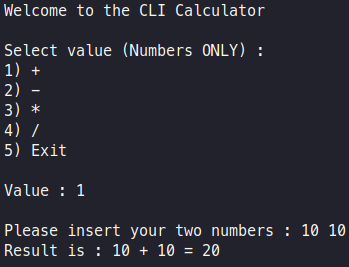
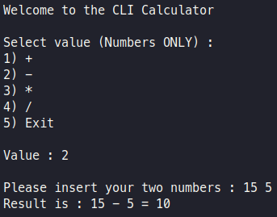
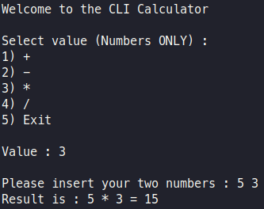
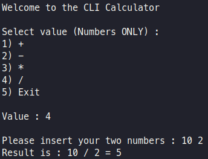

# CLI Calculator

Simple cli calculator wriiten in C++

```{.bash}
git clone https://github.com/DimitrisPa/cli-calculator
```

Compile

```{.bash}
g++ calculator.cpp -o cli-calculator
```

Run

```{.bash}
./cli-calculator
```

## Screenshots






## License

- Licensed under [GPLv3](LICENSE)
